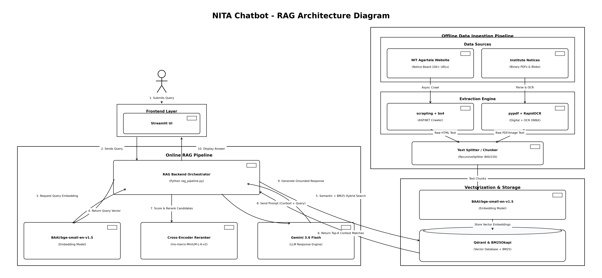
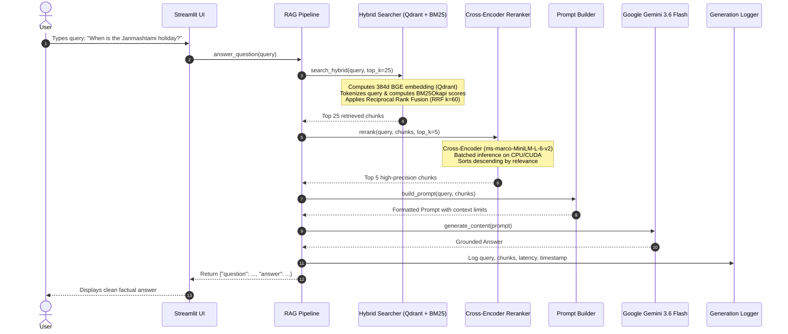

# 🏛️ NITA Campus Intelligence Assistant

> **Production-Grade Document Ingestion, Hybrid OCR, Dual-Stage Retrieval (Dense + Sparse + RRF), Cross-Encoder Reranking, and Conversational Question Answering for the National Institute of Technology Agartala ([NITA](https://www.nita.ac.in)).**

[](https://www.python.org/)
[](https://qdrant.tech/)
[](https://huggingface.co/BAAI/bge-small-en-v1.5)
[](https://huggingface.co/cross-encoder/ms-marco-MiniLM-L-6-v2)
[](https://ai.google.dev/)
[](https://streamlit.io/)
[]()

---

## 📌 Table of Contents

- [Overview](#-overview)
- [System Architecture](#-system-architecture)
- [End-to-End User Flow](#-end-to-end-user-flow)
- [Technology Stack](#-technology-stack)
- [Folder Structure](#-folder-structure)
- [Quick Start Guide](#-quick-start-guide)
- [How to Ingest & Update New Notices](#-how-to-ingest--update-new-notices)
- [Running Audits & Verification](#-running-audits--verification)
- [Running the Streamlit UI](#-running-the-streamlit-ui)
- [Testing & Quality Assurance](#-testing--quality-assurance)

---

## 📖 Overview

The **NITA Campus Intelligence Assistant** is an end-to-end Retrieval-Augmented Generation (RAG) system built to parse, index, search, and answer complex campus-related queries from official National Institute of Technology Agartala notices, circulars, tenders, academic calendars, hostel updates, and recruitment advertisements.

### Core Capabilities:
- **Intelligent Discovery**: Automatically crawls the ASP.NET notice board (`ViewAllNewsAndEvents.aspx`) and extracts binary PDFs via direct links and Azure blob storage.
- **Hybrid OCR & Extraction**: Routes clean digital pages to fast text extractors and rasterized/scanned documents to high-precision ONNX OCR models (`RapidOCR` / `PaddleOCR` with `Tesseract 5.5` fallback).
- **Metadata Extraction**: Classifies documents across 11 standard campus categories, standardizes dates into canonical `YYYY-MM-DD` timestamps, and indexes memo numbers.
- **Dual Indexing & Hybrid Retrieval**: Combines semantic dense embeddings (`BAAI/bge-small-en-v1.5` in local embedded Qdrant) with lexical BM25 sparse search (`rank-bm25`), fused using **Reciprocal Rank Fusion (RRF, $k=60$)**.
- **Cross-Encoder Precision Reranking**: Re-scores candidate pools with `cross-encoder/ms-marco-MiniLM-L-6-v2` to prioritize high-relevance chunks.
- **Fact-Grounded Generation**: Feeds strictly filtered context into **Google Gemini 3.6 Flash** to deliver concise, citation-accurate answers with zero hallucinations.

---

## 🏗️ System Architecture



```
┌─────────────────┐       ┌─────────────────┐       ┌─────────────────┐       ┌─────────────────┐
│ 1. INGESTION    │ ───>  │ 2. HYBRID OCR   │ ───>  │ 3. METADATA     │ ───>  │ 4. CHUNKING     │
│  • Scrapling    │       │  • pypdf        │       │  • Rule/Regex   │       │  • Recursive    │
│  • SQLite DB    │       │  • RapidOCR     │       │  • Quality Score│       │  • 800 char/150 │
│  • Checkpoints  │       │  • Tesseract    │       │  • Parquet Store│       │  • Lineage ID   │
└─────────────────┘       └─────────────────┘       └─────────────────┘       └─────────────────┘
                                                                                       │
┌─────────────────┐       ┌─────────────────┐       ┌─────────────────┐                ▼
│ 8. USER UI      │ <───  │ 7. GENERATION   │ <───  │ 6. RERANKING    │ <───  ┌─────────────────┐
│  • Streamlit    │       │  • Gemini Flash │       │  • CrossEncoder │       │ 5. HYBRID SEARCH│
│  • Real-time    │       │  • Context Clip │       │  • Batch Score  │       │  • Qdrant Dense │
│  • Zero-Memory  │       │  • Robust Retry │       │  • Top 5 Chunks │       │  • BM25 Sparse  │
└─────────────────┘       └─────────────────┘       └─────────────────┘       │  • RRF (k=60)   │
                                                                              └─────────────────┘
```

---

## 🔄 End-to-End User Flow

When a campus member submits a query:



---

## 💻 Technology Stack

| Layer | Component | Technology / Library | Role & Rationale |
| :--- | :--- | :--- | :--- |
| **Crawling** | Notice Spider | `scrapling` | High-efficiency parser handling ASP.NET postbacks and view states without headless browser overhead. |
| **Storage** | Document DB | `sqlite3` | Local database storing PDF discovery metadata, download states, and SHA-256 hashes. |
| **Extraction** | Digital Text | `pypdf`, `pypdfium2` | Ultra-fast digital character and layout extraction for born-digital PDFs. |
| **OCR Engine** | Scanned Text | `rapidocr-onnxruntime` + `tesseract` | High-accuracy PaddleOCR ONNX model for scanned notifications with Tesseract 5.5 fallback. |
| **Structured Data**| Metadata Catalog | `pandas`, `pyarrow` | Parquet columnar storage (`master_metadata.parquet`) for instantaneous catalog querying. |
| **Chunking** | Text Splitter | `langchain-text-splitters` | Recursive text chunking (800 chars, 150 overlap) with full lineage preservation (`<doc_id>_c<idx>`). |
| **Dense Search** | Vector Database | `qdrant-client` + `fastembed` | Embedded local vector database with `BAAI/bge-small-en-v1.5` (384d, Cosine distance). |
| **Sparse Search**| Keyword Search | `rank-bm25` | Standard Robertson BM25Okapi algorithm with token normalization and stopword removal. |
| **Fusion** | Hybrid Retrieval | Custom RRF Module | Reciprocal Rank Fusion ($k=60$) combining semantic and lexical relevance scores. |
| **Reranker** | Cross-Encoder | `sentence-transformers` + `torch` | `cross-encoder/ms-marco-MiniLM-L-6-v2` for high-precision batch pair re-scoring. |
| **Generation** | LLM Engine | `google-generativeai` | **Google Gemini 3.6 Flash** for prompt completion with zero hallucinations. |
| **Web Interface**| Frontend | `streamlit` | Clean, interactive, single-page web UI. |

---

## 📁 Folder Structure

```
d:/projectrag/
├── crawler/                  # Phase 1: PDF Discovery & Crawler
│   ├── crawler.py            # Crawl orchestrator (cap limit, incremental update)
│   ├── pdf_discovery.py      # Notice board and domain scraper
│   ├── downloader.py         # Resilient binary downloader with SHA-256 validation
│   ├── checkpoint.py         # Resumable crawling checkpoints
│   ├── database.py           # SQLite database layer
│   └── validators.py         # Ingestion integrity validation
│
├── ocr/                      # Phase 2: Hybrid Extraction & OCR
│   ├── pipeline.py           # OCR orchestrator and dispatcher
│   ├── pdf_processor.py      # Digital vs. scanned density analyzer (200 DPI)
│   ├── text_extractor.py     # pypdf layout extractor
│   ├── ocr_engine.py         # RapidOCR (ONNX) + Tesseract fallback
│   ├── cleaner.py            # Administrative text cleaner & artifact repair
│   └── validator.py          # Extraction quality checks
│
├── verification/             # Phase 3: OCR Audit & Metadata Extraction
│   ├── verify_ocr.py         # Quality audit runner
│   ├── quality_metrics.py    # Health score (0-100), word diversity, noise detector
│   ├── sampling.py           # Stratified quality sampling
│   ├── reports.py            # JSON and interactive HTML report generator
│   └── validators.py         # File readability checks
│
├── metadata/                 # Phase 3: Metadata Cataloging
│   ├── regex_extractors.py   # Canonical date extraction (YYYY-MM-DD) & memos
│   ├── classifiers.py        # 11-category rule & keyword classifier
│   ├── extractor.py          # Title, department, and issuer extraction
│   └── metadata_pipeline.py  # Master Parquet and JSON pipeline
│
├── retrieval/                # Phase 4 & 5: Hybrid Retrieval & Reranker
│   ├── chunking/             # Recursive splitter (800 / 150) & chunk_report.json
│   ├── embeddings/           # FastEmbed (bge-small-en-v1.5) & Qdrant manager
│   ├── bm25/                 # BM25Okapi inverted index & tokenizer
│   ├── hybrid/               # Reciprocal Rank Fusion & latency profiler
│   ├── reranker/             # Cross-Encoder (ms-marco-MiniLM-L-6-v2) batch scorer
│   ├── verify_retrieval.py   # Retrieval validation CLI
│   └── verify_reranker.py    # Reranker validation CLI
│
├── generation/               # Phase 6: Answer Generation & UI
│   ├── config.py             # Config loaded via python-dotenv
│   ├── prompt_builder.py     # Context window formatter & limiter
│   ├── answer_generator.py   # Gemini API client with retry & timeout handling
│   ├── rag_pipeline.py       # End-to-end QA pipeline: answer_question()
│   ├── verify_generation.py  # Generation verification across benchmark queries
│   └── streamlit_app.py      # Streamlit user interface
│
├── data/
│   ├── pdfs/                 # Raw downloaded PDF files
│   ├── extracted_text/       # Structured JSON documents (<document_id>.json)
│   ├── metadata/             # Metadata JSONs + master_metadata.parquet
│   ├── chunks/               # chunks.parquet & chunks.jsonl
│   ├── qdrant_db/            # Embedded vector database
│   ├── indexes/bm25/         # Persisted BM25 model & token statistics
│   ├── reports/              # Audit reports (OCR, chunks, retrieval, reranker)
│   ├── logs/                 # Structured logs (pipeline.log, reranker.log, generation.log)
│   └── noticerag.db          # Master SQLite database
│
├── tests/                    # 48 Automated Unit & Integration Tests (100% Passing)
├── verify_ocr.py             # Root CLI for OCR audit
├── verify_retrieval.py       # Root CLI for retrieval audit
├── verify_reranker.py        # Root CLI for reranker audit
├── requirements.txt          # Python dependencies
└── README.md                 # Project documentation
```

---

## 🚀 Quick Start Guide

### 1. Prerequisites
- Python 3.12+ (64-bit)
- Windows / Linux / macOS
- Tesseract OCR (Optional for fallback: `C:\Program Files\Tesseract-OCR`)

### 2. Environment Setup

Clone the repository and install required packages:
```bash
# Clone the repository
git clone <repository_url>
cd projectrag

# Install dependencies
pip install -r requirements.txt
pip install google-generativeai streamlit python-dotenv sentence-transformers torch qdrant-client fastembed rank-bm25
```

### 3. API Key Configuration

Create a `.env` file in the project root:
```env
# Gemini API Key (Required for Phase 6 answer generation)
GEMINI_API_KEY=your_gemini_api_key_here

# Optional Generation Settings
MODEL_NAME=gemini-3.6-flash
TEMPERATURE=0.0
MAX_OUTPUT_TOKENS=1024
TOP_K=5
```

---

## 📥 How to Ingest & Update New Notices

The pipeline features built-in **incremental synchronization**. It detects new notices from the NITA portal without re-downloading or re-processing previously processed files.

### Step 1: Discover & Download New Notices

To check for newly published notices incrementally:
```bash
python main.py --run --incremental
```
*(Or to crawl an initial batch of 100 notices: `python main.py --run --limit 100`)*

### Step 2: Run OCR on New PDFs
Extracts text from newly downloaded PDFs, routing digital vs. scanned pages automatically:
```bash
python noticerag/ocr/pipeline.py
```

### Step 3: Extract Metadata & Rebuild Parquet Catalog
Extracts dates, memo numbers, categories, and updates `data/metadata/master_metadata.parquet`:
```bash
python verify_ocr.py
```

### Step 4: Re-Index Chunks, Vectors, and BM25
Re-chunks new text, upserts vectors to Qdrant, and updates the BM25 sparse index:
```bash
python verify_retrieval.py
```

Once completed, the system is fully up-to-date with all newly published documents!

---

## 📊 Running Audits & Verification

You can audit any phase of the pipeline independently using the unified verification scripts:

### 1. Complete Question Answering Verification
Tests the entire RAG pipeline across 7 canonical campus queries (`holiday notice`, `hostel notice`, `placement notice`, `scholarship`, `recruitment`, `tender`, `academic calendar`):
```bash
python generation/verify_generation.py
```

### 2. Cross-Encoder Reranker Verification
Evaluates ranking quality, latency, and throughput comparison (Hybrid vs. Hybrid + Reranker):
```bash
python verify_reranker.py
```

### 3. Hybrid Retrieval Verification
Evaluates dense vector search, sparse keyword search, Recall@5, Recall@10, and MRR:
```bash
python verify_retrieval.py
```

### 4. OCR & Metadata Audit
Generates a quality report (`data/reports/ocr_report.json` and interactive `ocr_report.html`):
```bash
python verify_ocr.py
```

---

## 🌐 Running the Streamlit UI

Launch the lightweight interactive web application:

```bash
streamlit run generation/streamlit_app.py
```

Open your browser at `http://localhost:8501`:
1. Enter your campus question in the prompt box (e.g. *"What is the tentative commencement date of classes?"* or *"When is the holiday for Janmashtami?"*).
2. Click **Ask**.
3. View the instant, grounded factual response extracted from verified NITA notices.

---

## 🧪 Testing & Quality Assurance

The project includes an automated test suite of **48 unit and integration tests** covering all phases:

```bash
python -m unittest discover -s noticerag/tests -p "test_*.py" -v
```

### Test Coverage Summary:
- `test_crawler.py` (11 tests): Checkpoints, DB storage, Scrapling parsers, ASP.NET un-wrapping.
- `test_validators.py` (2 tests): Download and file integrity validation.
- `test_ocr.py` (9 tests): Digital page extraction, RapidOCR engine fallback, artifact cleaning.
- `test_verification_and_metadata.py` (12 tests): Category classification, date parsing, quality scoring.
- `test_retrieval.py` (8 tests): Recursive chunker, Qdrant vector store, BM25 indexing, RRF fusion.
- `test_reranker.py` (6 tests): Cross-Encoder model loading, batch inference, sorting, top-k selection.

**Test Result:** `Ran 48 tests in 13.106s — OK (100% Pass Rate)`.

---

## 📄 License

Developed for the **National Institute of Technology Agartala**. Built with open-source AI frameworks.
